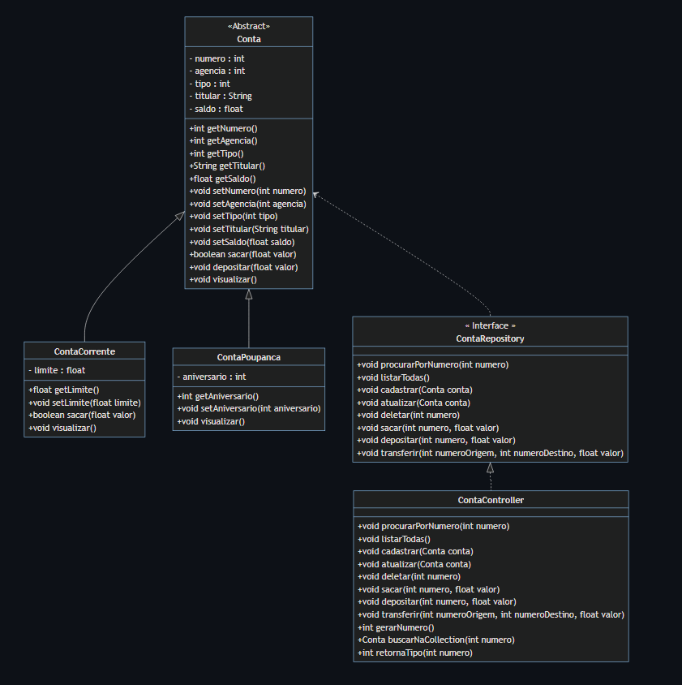
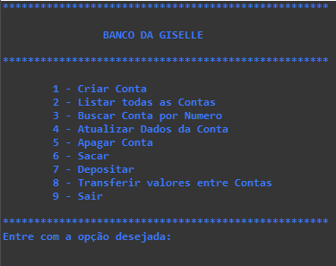

<h1 align="center">Conta Bancária</h1>

Projeto desenvolvido com Java durante o Bootcamp Generation Brasil.

🚧 Site em construção 🚧

### 🛠 Tecnologias:

As seguintes ferramentas foram usadas na construção do projeto:

### 📝 Fases do projeto: 

- [x] Criar projeto Spring Boot no Spring 
- [x] Criar o menu principal com Switch Case Lambida
- [x] Implementar cores com métodos
- [ ] ...

### 📊 Diagrama de classes:

### 💻 Menu de opções principais:
  

<h3>Autor</h3>

<h3>Giselle Souza</h3>
Projeto realizado por Giselle Souza orientada pelo professor Rafael Queiróz da Generation Brasil.
 

